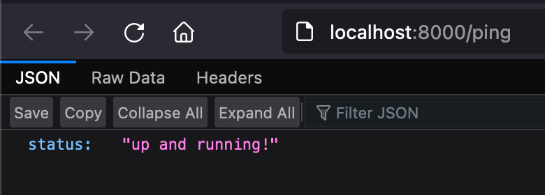
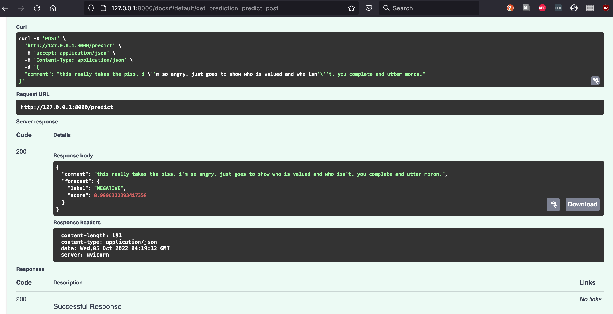
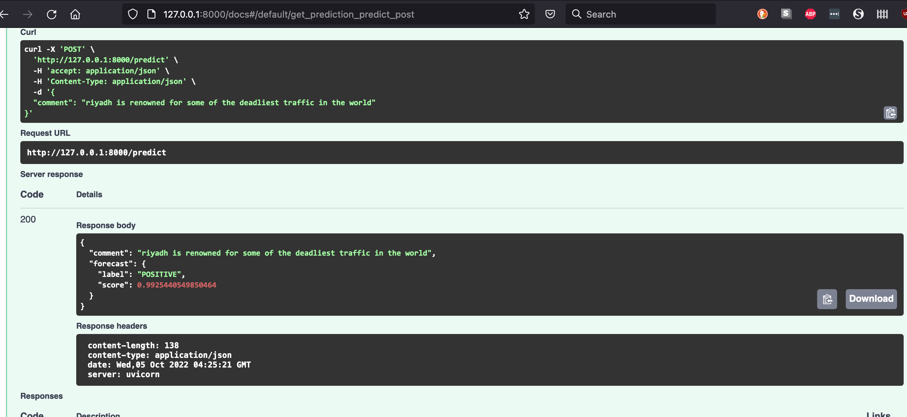

# HuggingFace sentiment predictor

We use a HuggingFace transformer model by creating an instance of pipeline to predict sentiments. 

To instantiate the classifier:

```
from transformers import pipeline
classifier = pipeline("sentiment-analysis")
```

This solution uses **FastAPI** with Uvicorn as ASGI web server implementation. 

This docker image runs one prediction at a time. In the future, multiple inputs can be implemented.

## Build

```
docker build -t sentiment .
```

## Run
```
docker run -d --name <CONTAINER_NAME> -p 8000:8000 sentiment
```

## Use the API
### liveness test
With the application running in a container, navigate to [http://localhost:8000/ping]() to use the basic liveness endpoint. 

<p align="center">

</p>


### make predictions
- Go to [http://127.0.0.1:8000/docs]()
- click on **POST**
- click on **Try it out**
- replace "string" with your text
- click **execute**
- scroll down to see the result
 
Alternatively you can use the following command in the CLI and substitute this text with yours. 

**Note** if your text includes single quotes (like I'm), you are better off using the web interface to handle the single quote. 

```
curl -X 'POST' \
  'http://127.0.0.1:8000/predict' \
  -H 'accept: application/json' \
  -H 'Content-Type: application/json' \
  -d '{
  "comment": "I had a so so day"
}'

```

## Reason to choose this model
I chose this model to compare the results to the tweeter dataset for hate speech (for the 3rd part of the assignment). Although non-hate/hate speech and and negative/positve sentiments don't map exactly but we can say that a hateful statement is negative most of the times. 

So I chose 2 tweets from the tweeter dataset for hate speech to compare their labels with this model's prediction 

- tweeter: non-hate
- model: negative sentiment


<p align="center">

</p>

- tweeter: hate
- model: positive sentiment

<p align="center">

</p>


